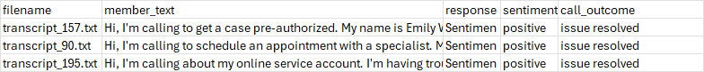
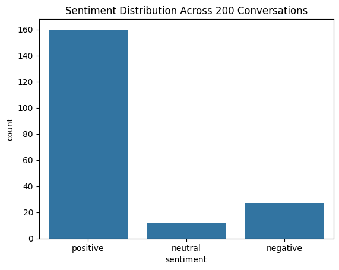
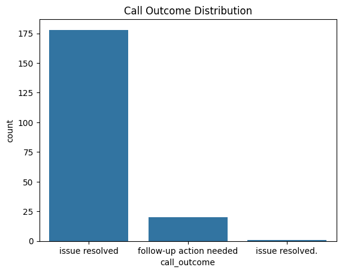
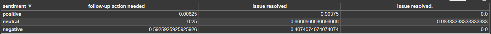

# GenAI Insurance Transcript Analysis

GenAI: Insurance Call Transcript Analysis
This project analyzes customer conversations from insurance call transcripts using Cohere’s Chat API to classify the sentiment and call outcome for each interaction. The project helps insurance companies monitor customer satisfaction and identify unresolved issues at scale.

Objectives
Extract customer messages from transcripts.

Use a large language model (Cohere) to:

Detect overall sentiment: positive, negative, or neutral.

Determine call outcome: issue resolved or follow-up action needed.

Summarize results and visualize key trends.
---

## Project Structure

GenAI_Project/
│
├── README.md                       # This file
├── data/                           # Folder of 200 .txt call transcripts
├── requirements.txt                # Python dependencies
├── SCR/
│ └── process_transcripts.py        # Main script for processing and classifying transcripts
├── Test/
│ └── test_basic.py                 # Basic unit tests (with mock API)
├── GenAI_Code.ipynb                # Main notebook (Colab)
├── GenAI_Code.pdf                  # PDF export of the code
├── analyzed_transcripts.csv        # Final processed results (CSV)
└── GenAI_Presentation.pdf          # Slides for stakeholder presentation


---

## 🚀 How to Run the Project

1. **Install dependencies:**

   ```bash
   pip install -r requirements.txt

2. **Set your Cohere API key**:

    add this line to your .env file or environment variables:
   ```ini
   COHERE_API_KEY=your_actual_api_key

3. **Run the script::**

   ```bash
   python SCR/process_transcripts.py

## 📊 Example Output



## 📈 Visualizations




## 📌 Business Value
* Scalable Monitoring: Analyze thousands of calls automatically.
* Customer Support Insight: Identify pain points or unresolved issues.
* Quality Assurance: Support training and coaching of call agents.

## ⚠️ Risks and Assumptions
* Assumes transcripts are correctly formatted and consistently labeled.
* LLM-generated outputs may include errors or "hallucinations."
* Sensitive to transcription quality and inconsistent speaker labels.

## ✅ Deliverables
* GitHub repo with scripts, tests, and README
* GenAI_Code.pdf: Code export from Colab
* GenAI_Presentation.pdf: Slides for stakeholders
* Final CSV of analyzed results


